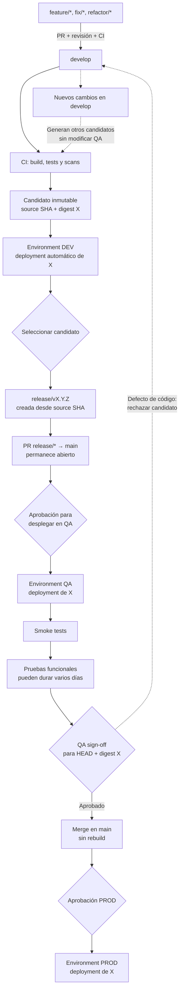

# Estrategia de branching

Esta estrategia implementa la decisión [ADR-001 — Estrategia de dos ramas con promoción por ambientes](architecture-decisions.md#adr-001--estrategia-de-dos-ramas-con-promoción-por-ambientes). Las ramas representan estados del código; DEV, QA y PROD se representan mediante GitHub Environments.

## Clasificación

Es una variante simplificada de Gitflow con prácticas de GitHub Flow:

- De Gitflow conserva `develop` como rama de integración, `main` como línea estable y el tratamiento especial de `hotfix/*`.
- De GitHub Flow adopta ramas temporales cortas, Pull Requests, revisión, CI y eliminación después del merge.
- No es GitHub Flow puro porque las ramas de trabajo se integran primero en `develop`, no directamente en `main`.
- No es Gitflow clásico completo: utiliza `release/*`, pero la promoción real ocurre por digest y GitHub Environments, no mediante ramas permanentes por ambiente ni toda la ceremonia tradicional de releases.
- No es trunk-based porque existen dos ramas permanentes y una etapa de integración previa a `main`.

El nombre oficial dentro de esta propuesta es **estrategia de dos ramas con promoción por ambientes**. Esta denominación describe el comportamiento real sin afirmar adhesión estricta a otro modelo.

## Prácticas adoptadas y adaptadas

La estrategia no es una invención aislada ni una implementación literal de un único modelo. Combina prácticas conocidas y agrega decisiones locales para responder a validaciones funcionales largas, un ambiente QA compartido, participación de factories y una disciplina de integración todavía en consolidación.

| Práctica | Origen | Uso en esta estrategia | Clasificación |
|---|---|---|---|
| `develop`, `release/*`, `main` y `hotfix/*` | Gitflow | Separar integración, estabilización, registro estable y urgencias | Adoptada y simplificada |
| Ramas temporales, PR, revisión y CI | GitHub Flow | Proteger toda integración y eliminar ramas después del merge | Adoptada |
| Desplegar una rama o SHA antes del merge | GitHub Deployments | Validar el candidato release en QA antes de incorporarlo a `main` | Adoptada |
| Required checks y branch protection | GitHub protected branches | Impedir el merge sin CI, revisión y `QA sign-off` | Adoptada |
| GitHub Environments | GitHub Actions | Representar DEV, QA y PROD con secrets, historial y aprobaciones | Adoptada |
| Build once, promote by digest | Continuous delivery | Garantizar identidad entre DEV, QA y PROD | Adoptada |
| PR release abierto durante QA | Necesidad organizacional apoyada en release branches | Aislar pruebas funcionales de varios días mientras `develop` avanza | Adaptada |
| `main` como registro previo a PROD, sin rebuild | Decisión local | Conservar código aprobado y desplegar después el digest ya validado | Adaptada |
| Un release activo por QA compartido | Restricción operativa local | Evitar reemplazos, cruces de evidencia y prioridades ambiguas | Adaptada |

Gitflow contempla crear una rama release desde `develop`, permitir allí únicamente estabilización y fusionarla en `main` cuando esté lista. GitHub permite que un deployment apunte a una rama, tag o SHA y reconoce el despliegue de ramas antes del merge. GitHub también permite exigir checks, revisiones y protecciones antes de fusionar un PR.

Referencias:

- [Gitflow Workflow — Atlassian](https://www.atlassian.com/git/tutorials/comparing-workflows/gitflow-workflow/)
- [GitHub Flow](https://docs.github.com/en/get-started/using-git/about-git#how-github-works)
- [Deploying code — GitHub Docs](https://docs.github.com/en/pull-requests/concepts/deploying-code)
- [REST API endpoints for deployments — GitHub Docs](https://docs.github.com/en/rest/deployments/deployments)
- [Controlling deployments with environments — GitHub Docs](https://docs.github.com/en/actions/how-tos/deploy/configure-and-manage-deployments/control-deployments)
- [Protected branches and required deployments — GitHub Docs](https://docs.github.com/en/repositories/configuring-branches-and-merges-in-your-repository/managing-protected-branches/about-protected-branches)
- [GitHub Actions limits](https://docs.github.com/en/actions/reference/limits)
- [DORA DevOps capabilities — Google Cloud](https://docs.cloud.google.com/architecture/devops)

## Flujo ordinario

Mientras el PR release permanece abierto, `develop` puede continuar recibiendo cambios y desplegándolos en DEV. Esos cambios generan otros candidatos, pero no modifican el digest instalado en QA.

## Ramas permanentes

`develop` integra funcionalidades y correcciones normales. Todo merge que modifica la aplicación ejecuta CI y, si resulta exitoso, despliega automáticamente a DEV. Un cambio exclusivo de documentación no crea artefacto ni deployment. `develop` no representa una versión productiva.

`main` registra código estable que completó el proceso de liberación. Todo merge ejecuta CI para verificar el estado registrado, pero no construye otra imagen ni inicia deployments. El estado real de producción lo identifica el historial del Environment `prod` y su digest.

## Ramas temporales

| Tipo | Nace de | PR hacia | Uso |
|---|---|---|---|
| `feature/*` | `develop` | `develop` | Funcionalidad nueva |
| `fix/*` | `develop` | `develop` | Corrección normal |
| `refactor/*` | `develop` | `develop` | Mejora interna sin nueva funcionalidad |
| `hotfix/*` | `main` | `main` | Incidente urgente; genera un candidato aislado y recorre DEV, QA y PROD |
| `release/*` | SHA candidato de `develop` | `main` | Fijar el candidato durante QA y registrar el código después del sign-off |

Ejemplos: `feature/add-version-endpoint`, `fix/version-format` y `hotfix/critical-api-error`. Deben ser breves y eliminarse tras el merge.

Después de promover un hotfix a PROD es obligatorio abrir un PR `main → develop`. Esto devuelve la corrección a la línea de integración y evita que un release posterior la revierta. Si hay conflictos, se resuelven en ese PR y se conserva el historial; no se hace force-push.

### Correcciones encontradas en QA

Un defecto funcional rechaza el digest candidato y bloquea el merge. La política inicial, elegida para reducir complejidad, consiste en corregir mediante `fix/* → develop`, generar una identidad nueva, validarla en DEV, cerrar el release rechazado y crear otro desde el nuevo SHA. Si la falla era solamente ambiental, se corrige QA y se reintenta el mismo artefacto sin cambios de código.

En una evolución con ambientes efímeros podrá corregirse directamente sobre `release/*`, construir un digest nuevo y validarlo primero en un ambiente temporal de candidato. En cualquier caso, cambiar un commit invalida smoke evidence y sign-off anteriores.

## Pull requests y protección recomendada

Flujos permitidos: `feature/* → develop`, `fix/* → develop`, `refactor/* → develop`, `release/* → main`, `hotfix/* → main` y `main → develop` para resincronización. Una rama `release/*` fija el SHA ya probado; no recompila ni representa un Environment.

Crear rulesets manuales para `main` y `develop`:

- bloquear push directo y force-push;
- requerir pull request y al menos una aprobación;
- exigir los checks `Build and test` y `Validate branch route`, además de la resolución de conversaciones;
- exigir rama actualizada antes del merge cuando el ritmo del equipo lo permita;
- restringir borrado y limitar excepciones a administradores designados.

Para `main` conviene usar mayor número de revisores o CODEOWNERS. La protección de ramas controla cambios de código; la protección del Environment controla el despliegue. Son capas complementarias.

El PR `release/* → main` debe crearse desde el SHA exacto asociado al digest candidato. Esto impide que nuevos commits de `develop` cambien silenciosamente el alcance mientras QA valida. La automatización empresarial deberá verificar esa correspondencia antes del merge.

El release también debe contener el estado actual de `main`. Si un hotfix modifica `main` durante QA, no se actualiza silenciosamente la rama ya aprobada: se sincroniza primero `main → develop`, se genera un candidato nuevo y se repite la validación.

El orden obligatorio es: seleccionar un SHA validado en DEV, crear `release/*`, abrir el PR hacia `main`, desplegar y validar ese candidato en QA, obtener la revisión funcional, fusionar el PR y finalmente aprobar PROD. La rama se elimina tras el merge. Los checks y la resolución automática del candidato relacionan PR, `source_sha` y digest.

## Ventajas y costes aceptados

| Ventaja | Coste o riesgo asociado |
|---|---|
| QA conserva un candidato estable durante varios días | La rama release puede divergir de `develop` |
| DEV puede continuar con el siguiente conjunto de cambios | Las correcciones QA necesitan una política explícita de sincronización |
| El mismo digest recorre DEV, QA y PROD | Se necesita un registro confiable entre SHA, digest, run y PR |
| `main` recibe solo código aceptado por QA | Aumenta el tiempo entre integración y merge a `main` |
| Rulesets reducen la dependencia de disciplina individual | Agrega aprendizaje y administración de protecciones |
| Un release activo evita reemplazos accidentales en QA | Puede generarse una cola si las pruebas funcionales son lentas |
| La evidencia queda asociada a actores y timestamps | El proceso tiene más estados y requiere observabilidad operativa |

Esta estrategia prioriza control y trazabilidad sobre velocidad. No se presenta como el modelo óptimo para siempre: DORA relaciona el alto desempeño con integración frecuente y trunk-based development, pero ese enfoque requiere tests confiables, cambios pequeños, feature flags, observabilidad y rollback que todavía deben consolidarse.

El PR, y no un workflow pendiente, conserva el estado durante las pruebas funcionales. GitHub limita la espera por aprobación de un Environment a 30 días y la duración total de un workflow a 35 días; separar el deployment del sign-off evita acoplar el proceso funcional a esos límites técnicos.

## Reglas operativas

- Solo puede existir un release activo por aplicación cuando se comparte un único QA.
- Un push a `develop` despliega únicamente a DEV y nunca reemplaza QA.
- QA se despliega desde el SHA fijado por `release/*`, nunca desde `develop` o un tag móvil.
- `release/*` es inmutable después de su creación; una corrección produce otro candidato en `develop` y otro release.
- El PR release permanece abierto mientras QA ejecuta pruebas funcionales.
- `QA sign-off` debe registrarse como revisión requerida para el HEAD actual del PR; el deployment QA y sus smoke tests son checks separados.
- Cualquier cambio de commit o digest invalida la evidencia y el sign-off anteriores.
- Si `main` cambia durante la validación —por ejemplo, por un hotfix— el release se considera desactualizado: debe resincronizarse mediante un candidato nuevo y repetir DEV y QA antes del merge.
- El merge en `main` no reconstruye el candidato.
- PROD solo acepta el digest aprobado por QA y registrado por el release fusionado.
- Las ramas release se eliminan después del merge.
- Las correcciones de release y hotfix deben regresar a `develop` cuando no estén ya presentes.

## Alternativas y evolución

El modelo anterior era `dev → qa → main`, con `main` asociada a PROD. La propuesta hace que `develop` construya el candidato una vez y que GitHub Environments promuevan su digest por DEV, QA y PROD. `main` registra el código liberado sin originar otro build.

No se mantienen ramas permanentes `qa` ni `release`: agregarían divergencia para representar estados que corresponden a deployments y controles. `release/*` existe únicamente durante la validación de un candidato y se elimina después del merge. Tampoco se interpreta `main` como el estado de PROD; ese estado pertenece al historial de deployments del Environment `prod`.

El modelo de solo `main` se considera una posible evolución, no el punto de partida. Se adoptará únicamente cuando los tests, feature flags, observabilidad y mecanismos de rollback permitan garantizar que `main` permanezca siempre desplegable.
