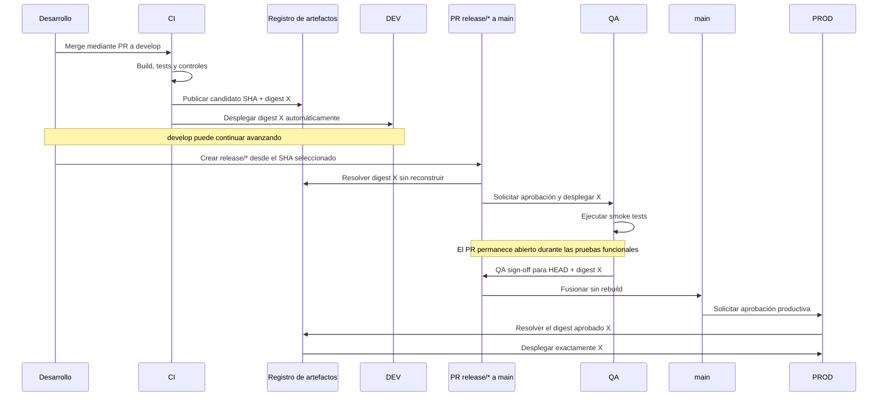

# Flujo CI/CD

Este documento describe la automatización de la PoC. La matriz empresarial de controles, publicación de imágenes y evolución de herramientas se encuentra en [Flujo de calidad y artefactos](quality-and-artifact-flow.md).

## CI

CI se ejecuta en cada push a `feature/*` y `fix/*` para dar feedback inmediato, y vuelve a ejecutarse en los PR hacia `develop` o `main`. Realiza restore, build, tests y publicación de resultados. Los pushes a ramas temporales y sus PR solo validan: no generan candidatos ni despliegan. Solo después de superar calidad, seguridad y delivery, un push integrado a `develop` publica `candidate-<commit SHA>` en DEV con retención de 30 días; `Deploy DEV` depende de esa publicación.

En el flujo objetivo, PR, `develop` y `main` ejecutan también Semgrep para SAST, SonarQube para análisis de calidad, SCA, secret scanning, container scanning e IaC scanning. Los merges repiten los controles sobre el commit integrado, pero solamente `develop` construye el candidato promovible. La PoC todavía no implementa esas herramientas y no debe interpretarse que ya estén operativas.

Un único job `Publish` selecciona mediante steps condicionales el pase correspondiente antes del deployment. En una implementación Docker, la imagen nace como `<versión>-dev`, se retaguea como `<versión>-rc` para QA y finalmente como `<versión>` para PROD. Las tres etiquetas apuntan al mismo digest; QA y PROD nunca reconstruyen la imagen. Los tres jobs de deployment dependen de `Publish`, que expone una identidad común de artefacto.

Los Markdown no disparan CI en push porque no cambian la aplicación; en PR sí se conserva el check requerido. Por ello, un merge compuesto exclusivamente por documentación no crea artefacto ni deployment, aunque actualice `develop` o `main`. `GITHUB_TOKEN` usa solo `contents: read` en CI.

## CD y promoción

### Decisiones y responsabilidades

| Control | Pregunta que responde | Resultado |
|---|---|---|
| Aprobación del Environment `qa` | ¿Se autoriza instalar este candidato en QA? | Deployment QA del digest seleccionado |
| Smoke tests | ¿La aplicación desplegada está técnicamente saludable? | Evidencia automática para SHA y digest |
| `QA sign-off` | ¿QA terminó las pruebas funcionales y acepta exactamente este candidato? | Revisión requerida para el HEAD del PR release |
| Merge `release/* → main` | ¿El código aprobado queda registrado como liberable? | Actualización protegida de `main`, sin rebuild |
| Aprobación del Environment `prod` | ¿Se autoriza desplegar ahora en producción? | Deployment del digest aceptado por QA |

La aprobación para desplegar en QA no equivale al sign-off funcional. Del mismo modo, el sign-off QA no sustituye la autorización operativa de PROD.



Los jobs de deployment no ejecutan `dotnet build` ni `dotnet publish`. Una ejecución de `CI/CD Pipeline` publica el candidato y termina después de desplegar DEV. Otra ejecución del mismo workflow resuelve el artefacto por el SHA del PR, recalcula su huella SHA-256, verifica el manifiesto y despliega QA. Después inicia la aplicación y valida `/health`, `/environment` y `/version`; solo si las respuestas coinciden publica `qa-smoke-evidence-<SHA>-<CI_RUN_ID>` y finaliza.

No se utiliza `workflow_run`. La acción `resolve-candidate` busca un artefacto no expirado llamado `candidate-<SHA>`, descarga sus metadatos y expone automáticamente run, versión y digest. El digest de la PoC representa el digest Docker que una implementación real resolvería desde ECR.

Crear o actualizar el PR `release/* → main` selecciona explícitamente el SHA que llegará a QA. `Deploy QA` espera la autorización del Environment `qa`; después de desplegar y superar smoke tests, el workflow termina. El PR continúa abierto durante los días que duren las pruebas funcionales y no puede fusionarse hasta recibir la revisión funcional requerida de QA.

El sign-off se vincula al HEAD y al digest actuales del PR mediante la revisión y las protecciones de `main`. La rama release se trata como inmutable. Si recibe otro commit, GitHub descarta la aprobación y `Resolve candidate` bloquea la promoción porque ese SHA no posee un artefacto construido y validado desde DEV. La corrección entra a `develop`, crea un candidato nuevo y origina otro release.

DEV cancela un deployment obsoleto cuando aparece otro más reciente. En QA, actualizar el mismo PR cancela su workflow obsoleto, mientras candidatos distintos comparten una concurrencia global y no reemplazan silenciosamente el ambiente. PROD nunca cancela un deployment iniciado por otro release.

Un sign-off exitoso habilita el merge del PR, no el deployment directo a PROD. El evento `pull_request: closed` con `merged == true` inicia los jobs de PROD del mismo workflow, recupera `pull_request.head.sha`, resuelve el digest aceptado por QA, solicita la aprobación de `prod` y despliega el mismo artefacto.

Los workflows usan las acciones de deployment obtenidas desde la rama base protegida, no desde el código propuesto por el PR. Esto evita que una rama release modifique la lógica que recibirá secrets del Environment antes de ser fusionada.

### Validaciones funcionales largas

Mientras QA prueba un candidato durante varios días, `develop` puede continuar recibiendo cambios y desplegándolos automáticamente en DEV. Ninguno de esos pushes modifica QA y ningún workflow permanece esperando el sign-off. Para un único ambiente QA compartido se admite un solo release activo; los candidatos posteriores esperan en cola. Si se requiere paralelismo, deben existir ambientes QA independientes.

GitHub permite esperar hasta 30 días por una aprobación de Environment y limita un workflow completo a 35 días. El diseño evita depender de esos límites: la espera funcional vive en el PR, que es el objeto durable del release, no en un job de Actions.

## Política de Pull Requests

El job `Validate branch route` es la puerta de entrada de las validaciones. En un PR comprueba la ruta antes de iniciar build, calidad, seguridad y delivery. Permite `feature/*`, `fix/*` y `refactor/*` hacia `develop`, `release/*` y `hotfix/*` hacia `main`, y `main` hacia `develop` para resincronización. Releases y hotfixes deben contener el estado actual de `main`; los hotfixes además no pueden incluir merges de otra línea de desarrollo. En un push, el trigger limita las ramas autorizadas antes de crear la ejecución.

## Fallas en QA

```text
QA fallido
├── configuración/infraestructura ──> corregir ambiente y reintentar mismo artefacto
└── defecto de código ──> corrección por PR a develop ──> nuevo candidato desde DEV
```

Los fallos conservan logs y respuestas parciales como `qa-diagnostics-*`. El artefacto rechazado nunca se elimina ni se modifica; simplemente no obtiene evidencia de promoción. Una corrección de código produce un nuevo candidato y repite DEV antes de volver a QA.

Cada job de deployment genera un resumen con aplicación, Environment, branch, SHA, versión, digest, timestamp UTC y run de origen. La revisión del PR conserva actor y momento del sign-off funcional. El despliegue es una simulación deliberada; una implementación futura sustituiría únicamente ese paso por el adaptador de plataforma, conservando las puertas y metadatos.

## Seguridad

- Actions oficiales versionadas a una versión mayor estable.
- Permisos mínimos: lectura de contenido y, solo en CD, artefactos/actions.
- Secrets definidos por Environment y nunca incluidos en el artefacto o logs.
- Concurrencia de CI cancela ejecuciones obsoletas de una misma referencia.
- Ninguna credencial cloud ni permisos `write` son necesarios.

La reducción de configuración duplicada proviene de `.github/actions/deploy/action.yml`: los tres ambientes consumen el mismo contrato, pero GitHub inyecta variables, secrets y controles propios. Al no ser un workflow, esta implementación compartida no agrega ejecuciones ni entradas a la lista de Actions.
