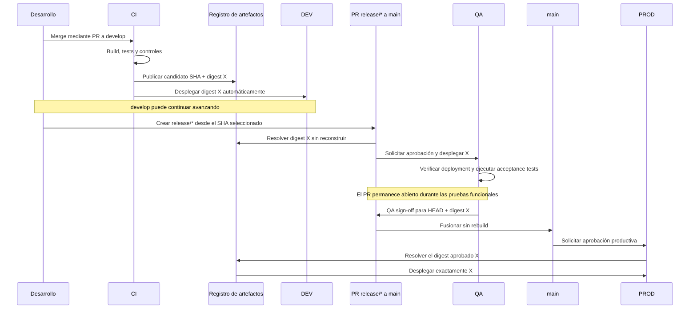

# Flujo CI/CD

Este documento describe la automatización de la PoC. La matriz empresarial de controles, publicación de imágenes y evolución de herramientas se encuentra en [Flujo de calidad y artefactos](quality-and-artifact-flow.md).

## CI

CI se ejecuta en cada push a `feature/*`, `fix/*` y `hotfix/*` para dar feedback inmediato, y vuelve a ejecutarse en los PR hacia `develop`. `Build` crea el entregable que consume `Tests`; en ramas temporales es efímero y nunca se publica como candidato ni se despliega. Un push integrado a `develop` repite esos gates y `Release` versiona, analiza y publica exactamente el entregable creado por `Build` como `candidate-<commit SHA>` con retención de 30 días antes de desplegar DEV.

En el flujo objetivo, PR, `develop` y `main` ejecutan también Semgrep para SAST, SonarQube para análisis de calidad, SCA, secret scanning, container scanning e IaC scanning. Los merges repiten los controles sobre el commit integrado, pero solamente `develop` construye el candidato promovible. La PoC todavía no implementa esas herramientas y no debe interpretarse que ya estén operativas.

La publicación es el último step de `Release` y existe únicamente en `Develop Delivery`. Los workflows de QA y PROD resuelven después ese candidato y cambian su referencia lógica sin modificar el contenido. En una implementación Docker, los tags `<versión>-dev`, `<versión>-rc` y `<versión>` apuntan al mismo digest. Para un ZIP, los ambientes referencian el mismo objeto y checksum. QA y PROD nunca reconstruyen ni vuelven a empaquetar.

Cada deployment tiene una verificación técnica independiente. Si el deployment o su verificación falla, el grafo habilita un job `Rollback <ambiente>` que registra la restauración simulada de la última versión estable. En PROD, una verificación exitosa habilita además `Production observability`; se evalúan disponibilidad, errores, latencia, logs y alertas antes de considerar finalizada la liberación.

### Grafo de dependencias acordado

```text
Validate
├── Build ──> Tests ──> Code quality scan ───────────────┐
├── Security scan ────────────────────────────────────────┤
└── Delivery checks (Dockerfile/IaC/workflows) ──────────┘
                                                           ↓
                                    Fin si es una rama temporal
                                                           │
                                    Continuar solo en push de develop
                                                           ↓
                                                        Release
                           (versionar, SBOM, verificar, escanear y publicar)
                                                           ↓
                                            DEV ──> QA ──> PROD
```

`Build` compila y crea el entregable una sola vez; `Tests` ejecuta pruebas unitarias y valida ese mismo contenido. Los controles de seguridad pueden avanzar en paralelo y `Code quality scan` depende de `Tests` porque consume cobertura. En ramas temporales el flujo termina al completar esos gates y el entregable efímero expira. En el push de `develop`, `Release` espera todos los gates, asigna versión y metadatos, genera el SBOM, ejecuta verificación de integridad, análisis de vulnerabilidades, malware y política de release, y finalmente publica el candidato inmutable con su digest. `Release` no recompila ni modifica `app/`.

Los Markdown no disparan CI en push porque no cambian la aplicación; en PR sí se conserva el check requerido. Por ello, un merge compuesto exclusivamente por documentación no crea artefacto ni deployment, aunque actualice `develop` o `main`. `GITHUB_TOKEN` usa solo `contents: read` en CI.

## CD y promoción

### Decisiones y responsabilidades

| Control | Pregunta que responde | Resultado |
|---|---|---|
| Aprobación del Environment `qa` | ¿Se autoriza instalar este candidato en QA? | Deployment QA del digest seleccionado |
| Verify deployment | ¿El artefacto correcto quedó desplegado y técnicamente saludable? | Evidencia automática de salud, SHA, versión y digest |
| `QA sign-off` | ¿QA terminó las pruebas funcionales y acepta exactamente este candidato? | Gate manual visible para el HEAD y digest del PR release |
| Merge `release/* → main` | ¿El código aprobado queda registrado como liberable? | Actualización protegida de `main`, sin rebuild |
| Aprobación del Environment `prod` | ¿Se autoriza desplegar ahora en producción? | Deployment del digest aceptado por QA |

La aprobación para desplegar en QA no equivale al sign-off funcional. Del mismo modo, el sign-off QA no sustituye la autorización operativa de PROD.


```mermaid
sequenceDiagram
    participant Dev as Desarrollo
    participant CI as CI
    participant Registry as Registro de artefactos
    participant DevEnv as DEV
    participant PR as PR release/* a main
    participant QA as QA
    participant Main as main
    participant Prod as PROD

    Dev->>CI: Merge mediante PR a develop
    CI->>CI: Build, tests y controles
    CI->>Registry: Publicar candidato SHA + digest X
    CI->>DevEnv: Desplegar digest X automáticamente
    Note over Dev,DevEnv: develop puede continuar avanzando

    Dev->>PR: Crear release/* desde el SHA seleccionado
    PR->>Registry: Resolver digest X sin reconstruir
    PR->>QA: Solicitar aprobación y desplegar X
    QA->>QA: Verificar deployment y ejecutar acceptance tests
    Note over PR,QA: El PR permanece abierto durante las pruebas funcionales
    QA->>PR: QA sign-off para HEAD + digest X
    PR->>Main: Fusionar sin rebuild
    Main->>Prod: Solicitar aprobación productiva
    Prod->>Registry: Resolver el digest aprobado X
    Registry->>Prod: Desplegar exactamente X
```

Las ramas temporales ejecutan solamente `Continuous Integration`. Después del merge, `Develop Delivery` crea el release, publica el candidato y valida DEV. `Release to QA` resuelve ese artefacto por el SHA del PR, despliega QA, ejecuta pruebas de aceptación y publica evidencia después del gate manual. Ninguna promoción reconstruye el candidato.

No se utiliza `workflow_run`. La acción `resolve-candidate` busca un artefacto no expirado llamado `candidate-<SHA>`, descarga sus metadatos y expone automáticamente run, versión y digest. El digest de la PoC representa el digest Docker que una implementación real resolvería desde ECR.

Crear o actualizar el PR `release/* → main` selecciona explícitamente el SHA que llegará a QA. `Approve and deploy QA` espera la autorización del Environment `qa`; después del deployment, `QA acceptance tests` valida el candidato y habilita `QA sign-off`. Este último queda en estado **Waiting** hasta que el reviewer funcional acepta el HEAD y digest exactos.

El sign-off se vincula al HEAD y al digest actuales del PR mediante la revisión y las protecciones de `main`. La rama release se trata como inmutable. Si recibe otro commit, GitHub descarta la aprobación y `Resolve candidate` bloquea la promoción porque ese SHA no posee un artefacto construido y validado desde DEV. La corrección entra a `develop`, crea un candidato nuevo y origina otro release.

DEV cancela un deployment obsoleto cuando aparece otro más reciente. En QA, actualizar el mismo PR cancela su workflow obsoleto, mientras candidatos distintos comparten una concurrencia global y no reemplazan silenciosamente el ambiente. PROD nunca cancela un deployment iniciado por otro release.

Un sign-off exitoso habilita el merge del PR, no el deployment directo a PROD. El push resultante en `main` inicia `Production Deployment`, recupera el SHA original del PR, resuelve el candidato y exige `Verify QA sign-off`. Ese job descarga la evidencia del workflow QA y compara SHA, digest, versión y run antes de habilitar `Approve and deploy PROD`.

Los workflows usan las acciones de deployment obtenidas desde la rama base protegida, no desde el código propuesto por el PR. Esto evita que una rama release modifique la lógica que recibirá secrets del Environment antes de ser fusionada.

### Validaciones funcionales largas

Mientras QA prueba un candidato durante varios días, `develop` puede continuar recibiendo cambios y desplegándolos automáticamente en DEV. Ninguno de esos pushes modifica QA y ningún workflow permanece esperando el sign-off. Para un único ambiente QA compartido se admite un solo release activo; los candidatos posteriores esperan en cola. Si se requiere paralelismo, deben existir ambientes QA independientes.

GitHub permite esperar hasta 30 días por una aprobación de Environment y limita un workflow completo a 35 días. El diseño evita depender de esos límites: la espera funcional vive en el PR, que es el objeto durable del release, no en un job de Actions.

## Política de Pull Requests

El job `Validate` es la puerta de entrada de las validaciones. En un PR comprueba la ruta antes de iniciar build, calidad, seguridad y delivery. Permite `feature/*`, `fix/*`, `refactor/*` y `hotfix/*` hacia `develop`, `release/*` hacia `main`, y `main` hacia `develop` para resincronización. Releases deben contener el estado actual de `main`. `Delivery checks` representa Hadolint, Checkov y actionlint; las herramientas siguen simuladas, pero sus políticas y ubicación en el flujo son explícitas.

## Fallas en QA

```text
QA fallido
├── configuración/infraestructura ──> corregir ambiente y reintentar mismo artefacto
└── defecto de código ──> corrección por PR a develop ──> nuevo candidato desde DEV
```

Los fallos conservan logs y respuestas parciales como `qa-diagnostics-*`. El artefacto rechazado nunca se elimina ni se modifica; simplemente no obtiene evidencia de promoción. Una corrección de código produce un nuevo candidato y repite DEV antes de volver a QA.

Cada job de deployment genera un resumen con aplicación, Environment, branch, SHA, versión, digest, timestamp UTC y run de origen. La revisión del PR conserva actor y momento del sign-off funcional. El despliegue es una simulación deliberada; una implementación futura sustituiría únicamente ese paso por el adaptador de plataforma, conservando las puertas y metadatos.

## Seguridad

- Actions oficiales versionadas a una versión mayor estable.
- Permisos mínimos: lectura de contenido y, solo en CD, artefactos/actions.
- Secrets definidos por Environment y nunca incluidos en el artefacto o logs.
- Concurrencia de CI cancela ejecuciones obsoletas de una misma referencia.
- Ninguna credencial cloud ni permisos `write` son necesarios.

La reducción de configuración duplicada proviene de `.github/actions/deploy/action.yml` y `.github/actions/verify-deployment/action.yml`: los tres ambientes consumen contratos comunes para deployment y verificación, pero los jobs y gates permanecen visibles en el grafo de Actions.
